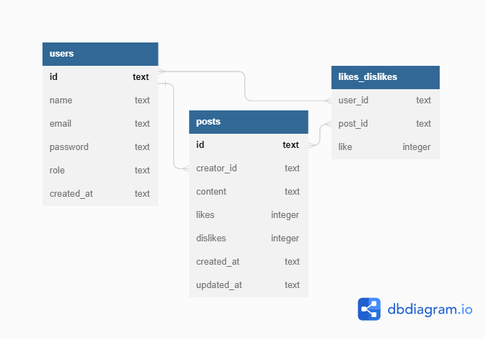

# Labook

Projeto back-end para a criação de uma rede social com o objetivo de promover a conexão e interação entre pessoas. Quem se cadastrar no aplicativo poderá criar e curtir publicações.

Na API foi implementada segurança, através de geração de UUID e hashes, além de autenticação e autorização via token.

## Funcionalidades

- 👥 Para usuários:
    - [x] Cadastro
    - [x] Login

- 📱 Para postagens:
    - [x] Consultar
    - [x] Criar
    - [x] Editar
    - [x] Deletar
    - [x] Curtir ou descurtir

🔶 Acesse [aqui](https://documenter.getpostman.com/view/24460902/2s93CHta6M) a documentação da API Labook.

## Banco de Dados

## Conteúdos abordados

- NodeJS
- Typescript
- Express
- SQL e SQLite
- Knex
- POO
- Arquitetura em camadas
- Geração de UUID
- Geração de hashes
- Autenticação e autorização
- Roteamento
- Postman

## 📧 Meu Contato

